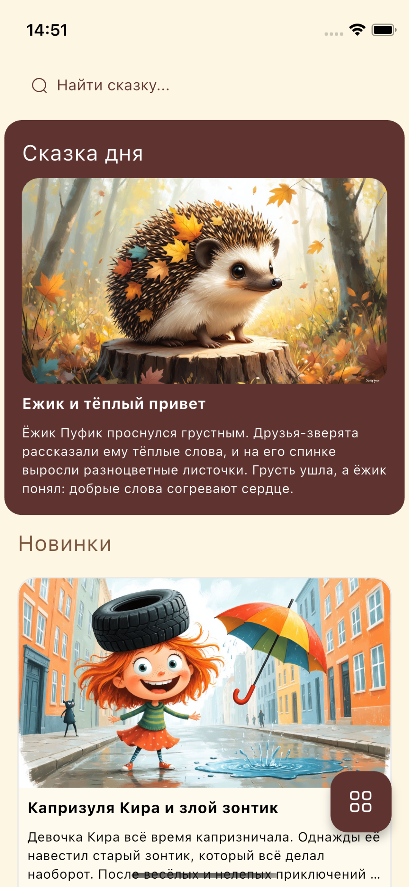
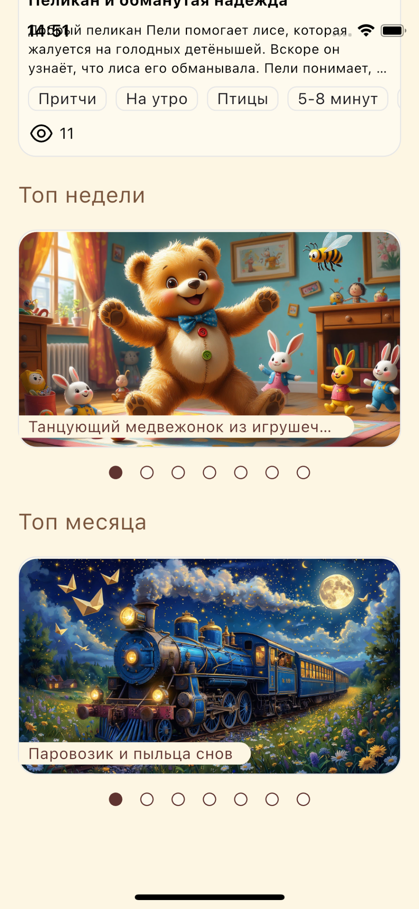
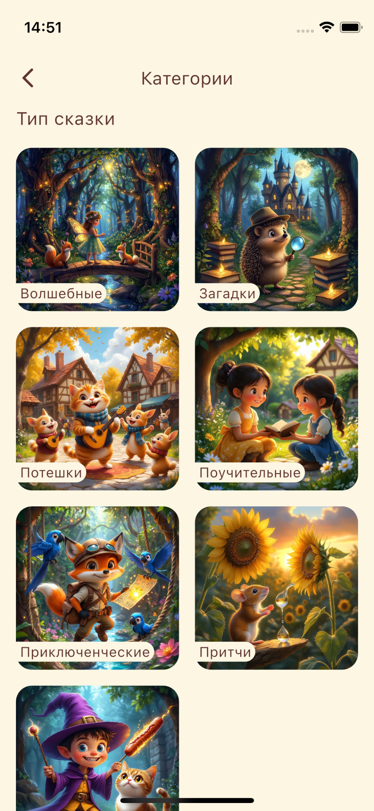
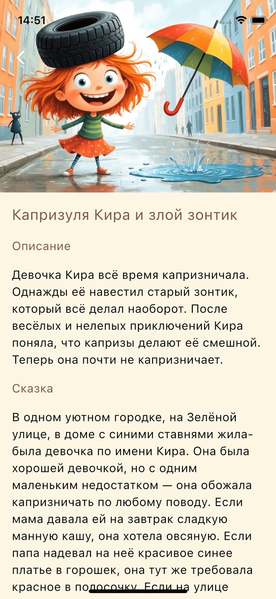

# Сказки для детей

Сказки для детей - мобильное приложение на Flutter, часть экосистемы “Сказки для детей”.
Позволяет пользователям читать и слушать сказки, загруженные с сервера, а также управлять контентом через админ-панель.

## Скриншоты

<p align="center">
  
  
  
  
</p>

## Описание 

Приложение подключается к Stories Server через REST API и использует общий пакет stories_data для моделей и логики работы с данными.
Реализована архитектура чистой многослойной структуры (Clean Architecture) с использованием BLoC, DI (get_it) и GoRouter.

## Архитектура и структура проекта

```
lib
 ┣ config
 ┃ ┣ UI
 ┃ ┃ ┣ app_assets.dart
 ┃ ┃ ┣ app_colors.dart
 ┃ ┃ ┣ app_text_style.dart
 ┃ ┃ ┗ app_theme.dart
 ┃ ┗ router
 ┃ ┃ ┣ router.dart
 ┃ ┃ ┗ routers.dart
 ┣ core
 ┃ ┣ functions
 ┃ ┃ ┣ di_stories_admin.dart
 ┃ ┃ ┗ sort_category_types.dart
 ┃ ┗ services
 ┃ ┃ ┗ audio_player_service.dart
 ┣ data
 ┣ presentation
 ┃ ┣ screens
 ┃ ┃ ┣ categories
 ┃ ┃ ┃ ┣ bloc
 ┃ ┃ ┃ ┃ ┣ categories_bloc.dart
 ┃ ┃ ┃ ┃ ┣ categories_event.dart
 ┃ ┃ ┃ ┃ ┗ categories_state.dart
 ┃ ┃ ┃ ┗ categories_screen.dart
 ┃ ┃ ┣ home
 ┃ ┃ ┃ ┣ bloc
 ┃ ┃ ┃ ┃ ┣ home_bloc.dart
 ┃ ┃ ┃ ┃ ┣ home_event.dart
 ┃ ┃ ┃ ┃ ┗ home_state.dart
 ┃ ┃ ┃ ┗ home_screen.dart
 ┃ ┃ ┣ no_internet
 ┃ ┃ ┃ ┗ bloc
 ┃ ┃ ┣ search
 ┃ ┃ ┃ ┣ bloc
 ┃ ┃ ┃ ┃ ┣ search_bloc.dart
 ┃ ┃ ┃ ┃ ┣ search_event.dart
 ┃ ┃ ┃ ┃ ┗ search_state.dart
 ┃ ┃ ┃ ┗ search_screen.dart
 ┃ ┃ ┣ stories_to_category
 ┃ ┃ ┃ ┣ bloc
 ┃ ┃ ┃ ┃ ┣ stories_to_category_bloc.dart
 ┃ ┃ ┃ ┃ ┣ stories_to_category_event.dart
 ┃ ┃ ┃ ┃ ┗ stories_to_category_state.dart
 ┃ ┃ ┃ ┗ stories_to_category_screen.dart
 ┃ ┃ ┣ story
 ┃ ┃ ┃ ┣ bloc
 ┃ ┃ ┃ ┃ ┣ story_bloc.dart
 ┃ ┃ ┃ ┃ ┣ story_event.dart
 ┃ ┃ ┃ ┃ ┗ story_state.dart
 ┃ ┃ ┃ ┗ story_screen.dart
 ┃ ┃ ┗ story_image_full
 ┃ ┃ ┃ ┗ story_image_full_screen.dart
 ┃ ┗ widgets
 ┃ ┃ ┣ player
 ┃ ┃ ┃ ┣ bloc
 ┃ ┃ ┃ ┃ ┣ app_player_bloc.dart
 ┃ ┃ ┃ ┃ ┣ app_player_event.dart
 ┃ ┃ ┃ ┃ ┗ app_player_state.dart
 ┃ ┃ ┃ ┗ app_player.dart
 ┃ ┃ ┣ app_button.dart
 ┃ ┃ ┣ story.dart
 ┃ ┃ ┗ story_categories_list.dart
 ┣ application.dart
 ┗ main.dart
```

## Технологии:

- Фреймворк: Flutter 3.8
- Язык: Dart
- Управление состоянием: BLoC / flutter_bloc
- DI: get_it
- Навигация: go_router
- HTTP клиент: dio
- Работа с окружением: flutter_dotenv
- Модели данных: stories_data (общий пакет)
- Кэш изображений: cached_network_image
- Аудио: just_audio, audio_session
- Работа с файлами: path_provider
- Иконки и изображения: flutter_svg, flutter_launcher_icons


## Связанные репозитории:

[Серверное приложение](https://github.com/RfMakar/stories_server)  

[Клиентское приложение](https://github.com/RfMakar/stories_client)  

[Админ приложение](https://github.com/RfMakar/stories_admin)  

[Пакет данных](https://github.com/RfMakar/stories_data) 

## Автор
**Максим Макарчук**


[Google Play](https://play.google.com/store/apps/details?id=ru.stories_client)  
[App Store](https://apps.apple.com/ru/app/%D1%81%D0%BA%D0%B0%D0%B7%D0%BA%D0%B8-%D0%B8-%D0%B8%D1%81%D1%82%D0%BE%D1%80%D0%B8%D0%B8-%D0%B4%D0%BB%D1%8F-%D0%B4%D0%B5%D1%82%D0%B5%D0%B9/id6749179855)  
[RuStore](https://www.rustore.ru/catalog/app/ru.stories_client)